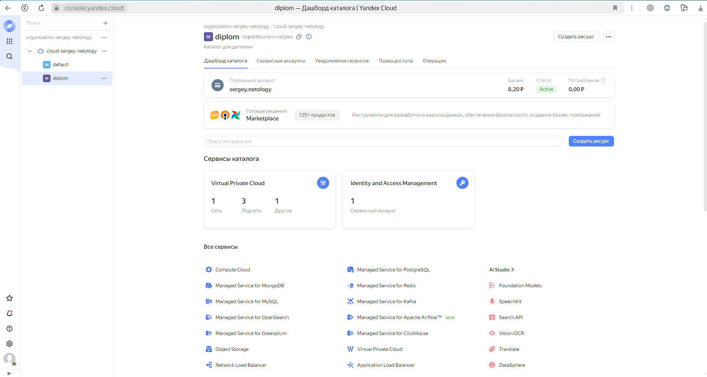
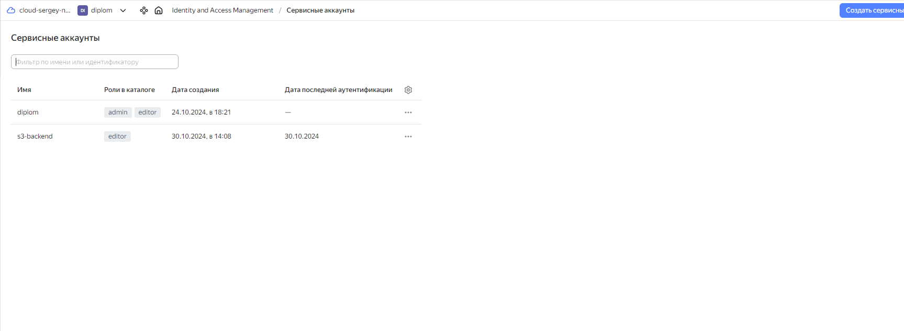

# Дипломный практикум в Yandex.Cloud
  * [Цели:](#цели)
  * [Этапы выполнения:](#этапы-выполнения)
     * [Создание облачной инфраструктуры](#создание-облачной-инфраструктуры)
     * [Создание Kubernetes кластера](#создание-kubernetes-кластера)
     * [Создание тестового приложения](#создание-тестового-приложения)
     * [Подготовка cистемы мониторинга и деплой приложения](#подготовка-cистемы-мониторинга-и-деплой-приложения)
     * [Установка и настройка CI/CD](#установка-и-настройка-cicd)
  * [Что необходимо для сдачи задания?](#что-необходимо-для-сдачи-задания)
  * [Как правильно задавать вопросы дипломному руководителю?](#как-правильно-задавать-вопросы-дипломному-руководителю)

**Перед началом работы над дипломным заданием изучите [Инструкция по экономии облачных ресурсов](https://github.com/netology-code/devops-materials/blob/master/cloudwork.MD).**

---
## Цели:

1. Подготовить облачную инфраструктуру на базе облачного провайдера Яндекс.Облако.
2. Запустить и сконфигурировать Kubernetes кластер.
3. Установить и настроить систему мониторинга.
4. Настроить и автоматизировать сборку тестового приложения с использованием Docker-контейнеров.
5. Настроить CI для автоматической сборки и тестирования.
6. Настроить CD для автоматического развёртывания приложения.

---
## Этапы выполнения:


### Создание облачной инфраструктуры

Для начала необходимо подготовить облачную инфраструктуру в ЯО при помощи [Terraform](https://www.terraform.io/).

Особенности выполнения:

- Бюджет купона ограничен, что следует иметь в виду при проектировании инфраструктуры и использовании ресурсов;
Для облачного k8s используйте региональный мастер(неотказоустойчивый). Для self-hosted k8s минимизируйте ресурсы ВМ и долю ЦПУ. В обоих вариантах используйте прерываемые ВМ для worker nodes.

Предварительная подготовка к установке и запуску Kubernetes кластера.

1. Создайте сервисный аккаунт, который будет в дальнейшем использоваться Terraform для работы с инфраструктурой с необходимыми и достаточными правами. Не стоит использовать права суперпользователя
2. Подготовьте [backend](https://www.terraform.io/docs/language/settings/backends/index.html) для Terraform:  
   а. Рекомендуемый вариант: S3 bucket в созданном ЯО аккаунте(создание бакета через TF)
   б. Альтернативный вариант:  [Terraform Cloud](https://app.terraform.io/)
3. Создайте конфигурацию Terrafrom, используя созданный бакет ранее как бекенд для хранения стейт файла. Конфигурации Terraform для создания сервисного аккаунта и бакета и основной инфраструктуры следует сохранить в разных папках.
4. Создайте VPC с подсетями в разных зонах доступности.
5. Убедитесь, что теперь вы можете выполнить команды `terraform destroy` и `terraform apply` без дополнительных ручных действий.
6. В случае использования [Terraform Cloud](https://app.terraform.io/) в качестве [backend](https://www.terraform.io/docs/language/settings/backends/index.html) убедитесь, что применение изменений успешно проходит, используя web-интерфейс Terraform cloud.

Ожидаемые результаты:

1. Terraform сконфигурирован и создание инфраструктуры посредством Terraform возможно без дополнительных ручных действий, стейт основной конфигурации сохраняется в бакете или Terraform Cloud
2. Полученная конфигурация инфраструктуры является предварительной, поэтому в ходе дальнейшего выполнения задания возможны изменения.

---
### Создание Kubernetes кластера

На этом этапе необходимо создать [Kubernetes](https://kubernetes.io/ru/docs/concepts/overview/what-is-kubernetes/) кластер на базе предварительно созданной инфраструктуры.   Требуется обеспечить доступ к ресурсам из Интернета.

Это можно сделать двумя способами:

1. Рекомендуемый вариант: самостоятельная установка Kubernetes кластера.  
   а. При помощи Terraform подготовить как минимум 3 виртуальных машины Compute Cloud для создания Kubernetes-кластера. Тип виртуальной машины следует выбрать самостоятельно с учётом требовании к производительности и стоимости. Если в дальнейшем поймете, что необходимо сменить тип инстанса, используйте Terraform для внесения изменений.  
   б. Подготовить [ansible](https://www.ansible.com/) конфигурации, можно воспользоваться, например [Kubespray](https://kubernetes.io/docs/setup/production-environment/tools/kubespray/)  
   в. Задеплоить Kubernetes на подготовленные ранее инстансы, в случае нехватки каких-либо ресурсов вы всегда можете создать их при помощи Terraform.
2. Альтернативный вариант: воспользуйтесь сервисом [Yandex Managed Service for Kubernetes](https://cloud.yandex.ru/services/managed-kubernetes)  
  а. С помощью terraform resource для [kubernetes](https://registry.terraform.io/providers/yandex-cloud/yandex/latest/docs/resources/kubernetes_cluster) создать **региональный** мастер kubernetes с размещением нод в разных 3 подсетях      
  б. С помощью terraform resource для [kubernetes node group](https://registry.terraform.io/providers/yandex-cloud/yandex/latest/docs/resources/kubernetes_node_group)
  
Ожидаемый результат:

1. Работоспособный Kubernetes кластер.
2. В файле `~/.kube/config` находятся данные для доступа к кластеру.
3. Команда `kubectl get pods --all-namespaces` отрабатывает без ошибок.

---
### Создание тестового приложения

Для перехода к следующему этапу необходимо подготовить тестовое приложение, эмулирующее основное приложение разрабатываемое вашей компанией.

Способ подготовки:

1. Рекомендуемый вариант:  
   а. Создайте отдельный git репозиторий с простым nginx конфигом, который будет отдавать статические данные.  
   б. Подготовьте Dockerfile для создания образа приложения.  
2. Альтернативный вариант:  
   а. Используйте любой другой код, главное, чтобы был самостоятельно создан Dockerfile.

Ожидаемый результат:

1. Git репозиторий с тестовым приложением и Dockerfile.
2. Регистри с собранным docker image. В качестве регистри может быть DockerHub или [Yandex Container Registry](https://cloud.yandex.ru/services/container-registry), созданный также с помощью terraform.

---
### Подготовка cистемы мониторинга и деплой приложения

Уже должны быть готовы конфигурации для автоматического создания облачной инфраструктуры и поднятия Kubernetes кластера.  
Теперь необходимо подготовить конфигурационные файлы для настройки нашего Kubernetes кластера.

Цель:
1. Задеплоить в кластер [prometheus](https://prometheus.io/), [grafana](https://grafana.com/), [alertmanager](https://github.com/prometheus/alertmanager), [экспортер](https://github.com/prometheus/node_exporter) основных метрик Kubernetes.
2. Задеплоить тестовое приложение, например, [nginx](https://www.nginx.com/) сервер отдающий статическую страницу.

Способ выполнения:
1. Воспользоваться пакетом [kube-prometheus](https://github.com/prometheus-operator/kube-prometheus), который уже включает в себя [Kubernetes оператор](https://operatorhub.io/) для [grafana](https://grafana.com/), [prometheus](https://prometheus.io/), [alertmanager](https://github.com/prometheus/alertmanager) и [node_exporter](https://github.com/prometheus/node_exporter). Альтернативный вариант - использовать набор helm чартов от [bitnami](https://github.com/bitnami/charts/tree/main/bitnami).

2. Если на первом этапе вы не воспользовались [Terraform Cloud](https://app.terraform.io/), то задеплойте и настройте в кластере [atlantis](https://www.runatlantis.io/) для отслеживания изменений инфраструктуры. Альтернативный вариант 3 задания: вместо Terraform Cloud или atlantis настройте на автоматический запуск и применение конфигурации terraform из вашего git-репозитория в выбранной вами CI-CD системе при любом комите в main ветку. Предоставьте скриншоты работы пайплайна из CI/CD системы.

Ожидаемый результат:
1. Git репозиторий с конфигурационными файлами для настройки Kubernetes.
2. Http доступ на 80 порту к web интерфейсу grafana.
3. Дашборды в grafana отображающие состояние Kubernetes кластера.
4. Http доступ на 80 порту к тестовому приложению.
---
### Установка и настройка CI/CD

Осталось настроить ci/cd систему для автоматической сборки docker image и деплоя приложения при изменении кода.

Цель:

1. Автоматическая сборка docker образа при коммите в репозиторий с тестовым приложением.
2. Автоматический деплой нового docker образа.

Можно использовать [teamcity](https://www.jetbrains.com/ru-ru/teamcity/), [jenkins](https://www.jenkins.io/), [GitLab CI](https://about.gitlab.com/stages-devops-lifecycle/continuous-integration/) или GitHub Actions.

Ожидаемый результат:

1. Интерфейс ci/cd сервиса доступен по http.
2. При любом коммите в репозиторие с тестовым приложением происходит сборка и отправка в регистр Docker образа.
3. При создании тега (например, v1.0.0) происходит сборка и отправка с соответствующим label в регистри, а также деплой соответствующего Docker образа в кластер Kubernetes.

# Решение дипломного проекта

### Создание облачной инфраструктуры

Для решения задач был создан новый каталог для диплома и новый сервисный аккаунт: 





Для бэкенда был написан конфигурационный файл [bucket.tf](/terraform-1/bucket/bucket.tf)

Вывод terraform apply

<details>
<summary>terraform apply</summary>

```bash
root@User:/mnt/c/Users/serpo/OneDrive/Документы/DZ_docker/diplom/diplom_project_DEVOPS/terraform-1/bucket# terraform apply

Terraform used the selected providers to generate the following execution plan. Resource actions are indicated with the following symbols:
  + create

Terraform will perform the following actions:

  # local_file.backendConf will be created
  + resource "local_file" "backendConf" {
      + content              = (sensitive value)
      + content_base64sha256 = (known after apply)
      + content_base64sha512 = (known after apply)
      + content_md5          = (known after apply)
      + content_sha1         = (known after apply)
      + content_sha256       = (known after apply)
      + content_sha512       = (known after apply)
      + directory_permission = "0777"
      + file_permission      = "0777"
      + filename             = "../backend.key"
      + id                   = (known after apply)
    }

  # yandex_iam_service_account.backend will be created
  + resource "yandex_iam_service_account" "backend" {
      + created_at = (known after apply)
      + folder_id  = (known after apply)
      + id         = (known after apply)
      + name       = "s3-backend"
    }

  # yandex_iam_service_account_static_access_key.sa-static-key will be created
  + resource "yandex_iam_service_account_static_access_key" "sa-static-key" {
      + access_key                   = (known after apply)
      + created_at                   = (known after apply)
      + description                  = "static access key"
      + encrypted_secret_key         = (known after apply)
      + id                           = (known after apply)
      + key_fingerprint              = (known after apply)
      + output_to_lockbox_version_id = (known after apply)
      + secret_key                   = (sensitive value)
      + service_account_id           = (known after apply)
    }

  # yandex_resourcemanager_folder_iam_member.terraform-editor will be created
  + resource "yandex_resourcemanager_folder_iam_member" "terraform-editor" {
      + folder_id = "b1go039uunbrcvnajpba"
      + id        = (known after apply)
      + member    = (known after apply)
      + role      = "editor"
    }

  # yandex_storage_bucket.diplom-bucket will be created
  + resource "yandex_storage_bucket" "diplom-bucket" {
      + access_key            = (known after apply)
      + acl                   = "private"
      + bucket                = "sergey.p-bucket"
      + bucket_domain_name    = (known after apply)
      + default_storage_class = (known after apply)
      + folder_id             = (known after apply)
      + force_destroy         = true
      + id                    = (known after apply)
      + secret_key            = (sensitive value)
      + website_domain        = (known after apply)
      + website_endpoint      = (known after apply)
    }

  # yandex_storage_object.object-1 will be created
  + resource "yandex_storage_object" "object-1" {
      + access_key   = (known after apply)
      + acl          = "private"
      + bucket       = "sergey.p-bucket"
      + content_type = (known after apply)
      + id           = (known after apply)
      + key          = "terraform.tfstate"
      + secret_key   = (sensitive value)
      + source       = "./terraform.tfstate"
    }

Plan: 6 to add, 0 to change, 0 to destroy.

Do you want to perform these actions?
  Terraform will perform the actions described above.
  Only 'yes' will be accepted to approve.

  Enter a value: yes

yandex_iam_service_account.backend: Creating...
yandex_iam_service_account.backend: Creation complete after 3s [id=ajelrtdpuoc3mst5587s]
yandex_resourcemanager_folder_iam_member.terraform-editor: Creating...
yandex_iam_service_account_static_access_key.sa-static-key: Creating...
yandex_iam_service_account_static_access_key.sa-static-key: Creation complete after -1s [id=aje2ejjiq8fap5qk5a0g]
yandex_storage_bucket.diplom-bucket: Creating...
yandex_resourcemanager_folder_iam_member.terraform-editor: Creation complete after 0s [id=b1go039uunbrcvnajpba/editor/serviceAccount:ajelrtdpuoc3mst5587s]
yandex_storage_bucket.diplom-bucket: Creation complete after 4s [id=sergey.p-bucket]
yandex_storage_object.object-1: Creating...
local_file.backendConf: Creating...
local_file.backendConf: Creation complete after 0s [id=4058221a3094278b06f7ea2e42b1f8c23ec03a6a]
yandex_storage_object.object-1: Creation complete after 0s [id=terraform.tfstate]

Apply complete! Resources: 6 added, 0 changed, 0 destroyed.
```
</details>


Создание VPC в разных подсетях:


<details>
<summary>terraform apply</summary>

```bash
root@User:/mnt/c/Users/serpo/OneDrive/Документы/DZ_docker/diplom/diplom_project_DEVOPS/terraform-1# terraform apply

Terraform used the selected providers to generate the following execution plan. Resource actions are indicated with the following symbols:
  + create

Terraform will perform the following actions:

  # yandex_compute_instance.VPC-instance[0] will be created
  + resource "yandex_compute_instance" "VPC-instance" {
      + allow_stopping_for_update = true
      + created_at                = (known after apply)
      + folder_id                 = (known after apply)
      + fqdn                      = (known after apply)
      + gpu_cluster_id            = (known after apply)
      + hardware_generation       = (known after apply)
      + hostname                  = "node-0"
      + id                        = (known after apply)
      + labels                    = {
          + "index" = "0"
        }
      + maintenance_grace_period  = (known after apply)
      + maintenance_policy        = (known after apply)
      + metadata                  = {
          + "ssh-keys" = "ubuntu:ssh-ed25519 AAAAC3NzaC1lZDI1NTE5AAAAILrmmjE2SF5JJsS9GChvmOkBc0uHHkuhHoG9b8zk1hZ0 root@User"
        }
      + name                      = "node-0"
      + network_acceleration_type = "standard"
      + platform_id               = "standard-v2"
      + service_account_id        = (known after apply)
      + status                    = (known after apply)
      + zone                      = "ru-central1-a"

      + boot_disk {
          + auto_delete = true
          + device_name = (known after apply)
          + disk_id     = (known after apply)
          + mode        = (known after apply)

          + initialize_params {
              + block_size  = (known after apply)
              + description = (known after apply)
              + image_id    = "fd8k2ed4jspu35gfde1u"
              + name        = (known after apply)
              + size        = 30
              + snapshot_id = (known after apply)
              + type        = "network-ssd"
            }
        }

      + network_interface {
          + index              = (known after apply)
          + ip_address         = (known after apply)
          + ipv4               = true
          + ipv6               = (known after apply)
          + ipv6_address       = (known after apply)
          + mac_address        = (known after apply)
          + nat                = true
          + nat_ip_address     = (known after apply)
          + nat_ip_version     = (known after apply)
          + security_group_ids = (known after apply)
          + subnet_id          = (known after apply)
        }

      + resources {
          + core_fraction = 100
          + cores         = 4
          + memory        = 4
        }

      + scheduling_policy {
          + preemptible = true
        }
    }

  # yandex_compute_instance.VPC-instance[1] will be created
  + resource "yandex_compute_instance" "VPC-instance" {
      + allow_stopping_for_update = true
      + created_at                = (known after apply)
      + folder_id                 = (known after apply)
      + fqdn                      = (known after apply)
      + gpu_cluster_id            = (known after apply)
      + hardware_generation       = (known after apply)
      + hostname                  = "node-1"
      + id                        = (known after apply)
      + labels                    = {
          + "index" = "1"
        }
      + maintenance_grace_period  = (known after apply)
      + maintenance_policy        = (known after apply)
      + metadata                  = {
          + "ssh-keys" = "ubuntu:ssh-ed25519 AAAAC3NzaC1lZDI1NTE5AAAAILrmmjE2SF5JJsS9GChvmOkBc0uHHkuhHoG9b8zk1hZ0 root@User"
        }
      + name                      = "node-1"
      + network_acceleration_type = "standard"
      + platform_id               = "standard-v2"
      + service_account_id        = (known after apply)
      + status                    = (known after apply)
      + zone                      = "ru-central1-b"

      + boot_disk {
          + auto_delete = true
          + device_name = (known after apply)
          + disk_id     = (known after apply)
          + mode        = (known after apply)

          + initialize_params {
              + block_size  = (known after apply)
              + description = (known after apply)
              + image_id    = "fd8k2ed4jspu35gfde1u"
              + name        = (known after apply)
              + size        = 30
              + snapshot_id = (known after apply)
              + type        = "network-ssd"
            }
        }

      + network_interface {
          + index              = (known after apply)
          + ip_address         = (known after apply)
          + ipv4               = true
          + ipv6               = (known after apply)
          + ipv6_address       = (known after apply)
          + mac_address        = (known after apply)
          + nat                = true
          + nat_ip_address     = (known after apply)
          + nat_ip_version     = (known after apply)
          + security_group_ids = (known after apply)
          + subnet_id          = (known after apply)
        }

      + resources {
          + core_fraction = 100
          + cores         = 4
          + memory        = 4
        }

      + scheduling_policy {
          + preemptible = true
        }
    }

  # yandex_compute_instance.VPC-instance[2] will be created
  + resource "yandex_compute_instance" "VPC-instance" {
      + allow_stopping_for_update = true
      + created_at                = (known after apply)
      + folder_id                 = (known after apply)
      + fqdn                      = (known after apply)
      + gpu_cluster_id            = (known after apply)
      + hardware_generation       = (known after apply)
      + hostname                  = "node-2"
      + id                        = (known after apply)
      + labels                    = {
          + "index" = "2"
        }
      + maintenance_grace_period  = (known after apply)
      + maintenance_policy        = (known after apply)
      + metadata                  = {
          + "ssh-keys" = "ubuntu:ssh-ed25519 AAAAC3NzaC1lZDI1NTE5AAAAILrmmjE2SF5JJsS9GChvmOkBc0uHHkuhHoG9b8zk1hZ0 root@User"
        }
      + name                      = "node-2"
      + network_acceleration_type = "standard"
      + platform_id               = "standard-v2"
      + service_account_id        = (known after apply)
      + status                    = (known after apply)
      + zone                      = "ru-central1-d"

      + boot_disk {
          + auto_delete = true
          + device_name = (known after apply)
          + disk_id     = (known after apply)
          + mode        = (known after apply)

          + initialize_params {
              + block_size  = (known after apply)
              + description = (known after apply)
              + image_id    = "fd8k2ed4jspu35gfde1u"
              + name        = (known after apply)
              + size        = 30
              + snapshot_id = (known after apply)
              + type        = "network-ssd"
            }
        }

      + network_interface {
          + index              = (known after apply)
          + ip_address         = (known after apply)
          + ipv4               = true
          + ipv6               = (known after apply)
          + ipv6_address       = (known after apply)
          + mac_address        = (known after apply)
          + nat                = true
          + nat_ip_address     = (known after apply)
          + nat_ip_version     = (known after apply)
          + security_group_ids = (known after apply)
          + subnet_id          = (known after apply)
        }

      + resources {
          + core_fraction = 100
          + cores         = 4
          + memory        = 4
        }

      + scheduling_policy {
          + preemptible = true
        }
    }

  # yandex_vpc_network.diplom-net will be created
  + resource "yandex_vpc_network" "diplom-net" {
      + created_at                = (known after apply)
      + default_security_group_id = (known after apply)
      + folder_id                 = (known after apply)
      + id                        = (known after apply)
      + labels                    = (known after apply)
      + name                      = "app-net"
      + subnet_ids                = (known after apply)
    }

  # yandex_vpc_subnet.diplom-subnet-zones[0] will be created
  + resource "yandex_vpc_subnet" "diplom-subnet-zones" {
      + created_at     = (known after apply)
      + folder_id      = (known after apply)
      + id             = (known after apply)
      + labels         = (known after apply)
      + name           = "subnet-ru-central1-a"
      + network_id     = (known after apply)
      + v4_cidr_blocks = [
          + "10.10.1.0/24",
        ]
      + v6_cidr_blocks = (known after apply)
      + zone           = "ru-central1-a"
    }

  # yandex_vpc_subnet.diplom-subnet-zones[1] will be created
  + resource "yandex_vpc_subnet" "diplom-subnet-zones" {
      + created_at     = (known after apply)
      + folder_id      = (known after apply)
      + id             = (known after apply)
      + labels         = (known after apply)
      + name           = "subnet-ru-central1-b"
      + network_id     = (known after apply)
      + v4_cidr_blocks = [
          + "10.10.2.0/24",
        ]
      + v6_cidr_blocks = (known after apply)
      + zone           = "ru-central1-b"
    }

  # yandex_vpc_subnet.diplom-subnet-zones[2] will be created
  + resource "yandex_vpc_subnet" "diplom-subnet-zones" {
      + created_at     = (known after apply)
      + folder_id      = (known after apply)
      + id             = (known after apply)
      + labels         = (known after apply)
      + name           = "subnet-ru-central1-d"
      + network_id     = (known after apply)
      + v4_cidr_blocks = [
          + "10.10.3.0/24",
        ]
      + v6_cidr_blocks = (known after apply)
      + zone           = "ru-central1-d"
    }

Plan: 7 to add, 0 to change, 0 to destroy.

Changes to Outputs:
  + external_ip_address_nodes = {
      + node-0 = (known after apply)
      + node-1 = (known after apply)
      + node-2 = (known after apply)
    }
  + internal_ip_address_nodes = {
      + node-0 = (known after apply)
      + node-1 = (known after apply)
      + node-2 = (known after apply)
    }

Do you want to perform these actions?
  Terraform will perform the actions described above.
  Only 'yes' will be accepted to approve.

  Enter a value: yes

yandex_vpc_network.diplom-net: Creating...
yandex_vpc_network.diplom-net: Creation complete after 2s [id=enp9ldqfph5irde0kj0o]
yandex_vpc_subnet.diplom-subnet-zones[0]: Creating...
yandex_vpc_subnet.diplom-subnet-zones[1]: Creating...
yandex_vpc_subnet.diplom-subnet-zones[2]: Creating...
yandex_vpc_subnet.diplom-subnet-zones[1]: Creation complete after 1s [id=e2l6nqqjstnajoi8duuq]
yandex_vpc_subnet.diplom-subnet-zones[0]: Creation complete after 1s [id=e9bkhrtp0peg7a8ln3jq]
yandex_vpc_subnet.diplom-subnet-zones[2]: Creation complete after 2s [id=fl8god8lek8kopccn5hp]
yandex_compute_instance.VPC-instance[2]: Creating...
yandex_compute_instance.VPC-instance[1]: Creating...
yandex_compute_instance.VPC-instance[0]: Creating...
yandex_compute_instance.VPC-instance[0]: Still creating... [10s elapsed]
yandex_compute_instance.VPC-instance[2]: Still creating... [10s elapsed]
yandex_compute_instance.VPC-instance[1]: Still creating... [10s elapsed]
yandex_compute_instance.VPC-instance[2]: Still creating... [20s elapsed]
yandex_compute_instance.VPC-instance[0]: Still creating... [20s elapsed]
yandex_compute_instance.VPC-instance[1]: Still creating... [20s elapsed]
yandex_compute_instance.VPC-instance[1]: Still creating... [27s elapsed]
yandex_compute_instance.VPC-instance[2]: Still creating... [27s elapsed]
yandex_compute_instance.VPC-instance[0]: Still creating... [27s elapsed]
yandex_compute_instance.VPC-instance[2]: Creation complete after 35s [id=fv4uq9bi3dg6plvc0foc]
yandex_compute_instance.VPC-instance[1]: Still creating... [37s elapsed]
yandex_compute_instance.VPC-instance[0]: Still creating... [37s elapsed]
yandex_compute_instance.VPC-instance[0]: Creation complete after 43s [id=fhm2vftc7tju8lg5igqc]
yandex_compute_instance.VPC-instance[1]: Still creating... [47s elapsed]
yandex_compute_instance.VPC-instance[1]: Creation complete after 48s [id=epd26g77nbnm4suhtn66]

Apply complete! Resources: 7 added, 0 changed, 0 destroyed.

Outputs:

external_ip_address_nodes = {
  "node-0" = "89.169.157.35"
  "node-1" = "158.160.20.51"
  "node-2" = "84.252.135.181"
}
internal_ip_address_nodes = {
  "node-0" = "10.10.1.10"
  "node-1" = "10.10.2.7"
  "node-2" = "10.10.3.28"
}
```
</details>

Я попытался зарезервировать полученные ip адреса, что бы избежать разрушения кластера, но удалось зарезервировать только 2 из 3, поэтому ip адреса могут меняться

UPD: Удалось зарезервировать ip адреса, через тех поддержку, путем увеличения квоты.


### Создание Kubernetes кластера

Теперь приступаю с сборке кластера, буду использовать kubespray. 

В файле README были прописаны команды для создания и запуска:

Использовал следующие команды:

```declare -a IPS=(158.160.20.51 89.169.157.35 84.252.135.181)```

```CONFIG_FILE=inventory/mycluster/hosts.yaml python3 contrib/inventory_builder/inventory.py ${IPS[@]}```

Обязательно нужно установить зависимости:

```pip install -r requirements.txt```

Запуск команды создания кластера:

```ansible-playbook -i inventory/mycluster/hosts.yaml -u ubuntu --become --become-user=root cluster.yml```

```bash
PLAY RECAP *****************************************************************************************************************************************************************************************************
node1                      : ok=619  changed=129  unreachable=0    failed=0    skipped=1063 rescued=0    ignored=6   
node2                      : ok=402  changed=74   unreachable=0    failed=0    skipped=640  rescued=0    ignored=1   
node3                      : ok=402  changed=74   unreachable=0    failed=0    skipped=638  rescued=0    ignored=1   

Monday 04 November 2024  09:51:37 +0300 (0:00:00.139)       0:10:56.506 *******
===============================================================================
download : Download_container | Download image if required --------------------------------------------------------------------------------------------------------------------------------------------- 47.04s 
kubernetes/control-plane : Kubeadm | Initialize first control plane node ------------------------------------------------------------------------------------------------------------------------------- 44.68s 
download : Download_container | Download image if required --------------------------------------------------------------------------------------------------------------------------------------------- 21.28s 
kubernetes/preinstall : Install packages requirements -------------------------------------------------------------------------------------------------------------------------------------------------- 16.22s 
kubernetes/kubeadm : Join to cluster ------------------------------------------------------------------------------------------------------------------------------------------------------------------- 15.31s 
download : Download_container | Download image if required --------------------------------------------------------------------------------------------------------------------------------------------- 15.18s 
kubernetes-apps/ansible : Kubernetes Apps | Lay Down CoreDNS templates --------------------------------------------------------------------------------------------------------------------------------- 12.43s 
download : Download_container | Download image if required --------------------------------------------------------------------------------------------------------------------------------------------- 11.68s 
network_plugin/calico : Wait for calico kubeconfig to be created --------------------------------------------------------------------------------------------------------------------------------------- 11.51s 
download : Download_file | Download item --------------------------------------------------------------------------------------------------------------------------------------------------------------- 10.38s 
etcd : Reload etcd ------------------------------------------------------------------------------------------------------------------------------------------------------------------------------------- 10.24s 
network_plugin/calico : Calico | Copy calicoctl binary from download dir ------------------------------------------------------------------------------------------------------------------------------- 10.23s 
download : Prep_kubeadm_images | Copy kubeadm binary from download dir to system path ------------------------------------------------------------------------------------------------------------------- 7.10s 
etcd : Configure | Check if etcd cluster is healthy ----------------------------------------------------------------------------------------------------------------------------------------------------- 6.93s 
network_plugin/calico : Calico | Create calico manifests ------------------------------------------------------------------------------------------------------------------------------------------------ 6.65s 
container-engine/containerd : Download_file | Download item --------------------------------------------------------------------------------------------------------------------------------------------- 6.50s 
etcdctl_etcdutl : Copy etcdctl and etcdutl binary from download dir ------------------------------------------------------------------------------------------------------------------------------------- 6.31s 
container-engine/crictl : Download_file | Download item ------------------------------------------------------------------------------------------------------------------------------------------------- 5.78s 
download : Download_container | Download image if required ---------------------------------------------------------------------------------------------------------------------------------------------- 5.40s 
download : Download_container | Download image if required ---------------------------------------------------------------------------------------------------------------------------------------------- 5.33s 
```

Проверка состояния кластера:

```bash
ubuntu@node1:~$ sudo su
root@node1:/home/ubuntu# kubectl get nodes
NAME    STATUS   ROLES           AGE   VERSION
node1   Ready    control-plane   11m   v1.31.1
node2   Ready    <none>          10m   v1.31.1
node3   Ready    <none>          10m   v1.31.1
root@node1:/home/ubuntu# kubectl get pods --all-namespaces
NAMESPACE     NAME                                       READY   STATUS    RESTARTS   AGE
kube-system   calico-kube-controllers-55d498b656-lxm6k   1/1     Running   0          9m52s
kube-system   calico-node-6phct                          1/1     Running   0          10m
kube-system   calico-node-6xdnc                          1/1     Running   0          10m
kube-system   calico-node-n5b74                          1/1     Running   0          10m
kube-system   coredns-d665d669-r6bv8                     1/1     Running   0          9m33s
kube-system   coredns-d665d669-rgspk                     1/1     Running   0          9m26s
kube-system   dns-autoscaler-5cb4578f5f-t8hvv            1/1     Running   0          9m29s
kube-system   kube-apiserver-node1                       1/1     Running   1          11m
kube-system   kube-controller-manager-node1              1/1     Running   3          11m
kube-system   kube-proxy-6g7sd                           1/1     Running   0          10m
kube-system   kube-proxy-b99gm                           1/1     Running   0          10m
kube-system   kube-proxy-rzhqw                           1/1     Running   0          10m
kube-system   kube-scheduler-node1                       1/1     Running   2          11m
kube-system   nginx-proxy-node2                          1/1     Running   0          10m
kube-system   nginx-proxy-node3                          1/1     Running   0          10m
kube-system   nodelocaldns-98vp9                         1/1     Running   0          9m29s
kube-system   nodelocaldns-d2mtg                         1/1     Running   0          9m29s
kube-system   nodelocaldns-d2s62                         1/1     Running   0          9m29s
```

Файл ```~/.kube/config```

```bash
root@node1:/home/ubuntu# kubectl config view
apiVersion: v1
clusters:
- cluster:
    certificate-authority-data: DATA+OMITTED
    server: https://158.160.20.51:6443
  name: cluster.local
contexts:
- context:
    cluster: cluster.local
    user: kubernetes-admin
  name: kubernetes-admin@cluster.local
current-context: kubernetes-admin@cluster.local
kind: Config
preferences: {}
users:
- name: kubernetes-admin
  user:
    client-certificate-data: DATA+OMITTED
    client-key-data: DATA+OMITTED
```

### Создание тестового приложения

Создаем папку app, в ней папки: 

- conf - файл конфигурации

- cont - контент (файл index.html)

- deploy - для дальнейшего деплоя на кластер

Собираем образ из Dockerfile

```bash
PS C:\Users\serpo\OneDrive\Документы\DZ_docker\diplom\diplom_project_DEVOPS\app> docker build -t nginx_diplom .
[+] Building 7.3s (8/8) FINISHED                                                                                                                                                           docker:desktop-linux
 => [internal] load build definition from Dockerfile                                                                                                                                                       0.0s
 => => transferring dockerfile: 418B                                                                                                                                                                       0.0s 
 => [internal] load metadata for docker.io/library/nginx:latest                                                                                                                                            2.2s 
 => [internal] load .dockerignore                                                                                                                                                                          0.0s
 => => transferring context: 2B                                                                                                                                                                            0.0s 
 => [1/3] FROM docker.io/library/nginx:latest@sha256:28402db69fec7c17e179ea87882667f1e054391138f77ffaf0c3eb388efc3ffb                                                                                      2.5s 
 => => resolve docker.io/library/nginx:latest@sha256:28402db69fec7c17e179ea87882667f1e054391138f77ffaf0c3eb388efc3ffb                                                                                      0.0s 
 => => sha256:3b25b682ea82b2db3cc4fd48db818be788ee3f902ac7378090cf2624ec2442df 8.71kB / 8.71kB                                                                                                             0.0s 
 => => sha256:f3ace1b8ce45351f711f841b07ecc15383939db71555b947a9ffef6fb168ab18 43.80MB / 43.80MB                                                                                                           2.5s 
 => => sha256:28402db69fec7c17e179ea87882667f1e054391138f77ffaf0c3eb388efc3ffb 10.27kB / 10.27kB                                                                                                           0.0s 
 => => sha256:367678a80c0be120f67f3adfccc2f408bd2c1319ed98c1975ac88e750d0efe26 2.29kB / 2.29kB                                                                                                             0.0s 
 => => sha256:a480a496ba95a197d587aa1d9e0f545ca7dbd40495a4715342228db62b67c4ba 29.13MB / 29.13MB                                                                                                           1.4s 
 => => sha256:11d6fdd0e8a78c038b5c013368f76279d21e5ee239f18a1e20a3593414fa1095 629B / 629B                                                                                                                 0.8s 
 => => sha256:f1091da6fd5cd13c1004024fdc5661a0456be67716d81671d8d2e7f81c0dbc2e 955B / 955B                                                                                                                 1.1s 
 => => sha256:40eea07b53d8dc814d92f772a7b2be5c1c3914b05e3edcb5f2489e805885a0a3 404B / 404B                                                                                                                 1.5s 
 => => extracting sha256:a480a496ba95a197d587aa1d9e0f545ca7dbd40495a4715342228db62b67c4ba                                                                                                                  0.0s
 => => sha256:6476794e50f4265ce2cab9c2ef2444dae937d28280a742899c8770fbca18bfed 1.21kB / 1.21kB                                                                                                             1.8s
 => => sha256:70850b3ec6b2d92e9ccdff63bbd5d1aa0dec25087cb2507165f7538ffc7029df 1.40kB / 1.40kB                                                                                                             1.9s
 => => extracting sha256:f3ace1b8ce45351f711f841b07ecc15383939db71555b947a9ffef6fb168ab18                                                                                                                  1.2s
 => => extracting sha256:11d6fdd0e8a78c038b5c013368f76279d21e5ee239f18a1e20a3593414fa1095                                                                                                                  0.0s
 => => extracting sha256:f1091da6fd5cd13c1004024fdc5661a0456be67716d81671d8d2e7f81c0dbc2e                                                                                                                  0.0s 
 => => extracting sha256:40eea07b53d8dc814d92f772a7b2be5c1c3914b05e3edcb5f2489e805885a0a3                                                                                                                  0.0s 
 => => extracting sha256:6476794e50f4265ce2cab9c2ef2444dae937d28280a742899c8770fbca18bfed                                                                                                                  0.0s 
 => => extracting sha256:70850b3ec6b2d92e9ccdff63bbd5d1aa0dec25087cb2507165f7538ffc7029df                                                                                                                  0.0s 
 => [internal] load build context                                                                                                                                                                          0.0s 
 => => transferring context: 3.48kB                                                                                                                                                                        0.0s 
 => [2/3] COPY conf /etc/nginx                                                                                                                                                                             0.2s 
 => [3/3] COPY cont /usr/share/nginx/html                                                                                                                                                                  0.1s 
 => exporting to image                                                                                                                                                                                     0.1s 
 => => exporting layers                                                                                                                                                                                    0.1s 
 => => writing image sha256:bf9365fff580be524bd52b575e34e95757766f1ce83fe7fb9e4e9b51f170ad78                                                                                                               0.0s 
 => => naming to docker.io/library/nginx_diplom                                                                                                                                                            0.0s 

View build details: docker-desktop://dashboard/build/desktop-linux/desktop-linux/vm87h7fc39hh5sr3ns5epqe70

What's next:
    View a summary of image vulnerabilities and recommendations → docker scout quickview
```

Теперь нужно проверить, соберу контейнер:


Образ 


Результат запущенного контейнера:


Выполнил вход в DockerHub, пришлось изменить название образа (иначе, загрузка просходила с ошибкой):

```bash
PS C:\Users\serpo\OneDrive\Документы\DZ_docker\diplom\diplom_project_DEVOPS\app> docker tag nginx_diplom:latest wanderwille/nginx_diplom:latest
PS C:\Users\serpo\OneDrive\Документы\DZ_docker\diplom\diplom_project_DEVOPS\app> docker image ls
REPOSITORY                 TAG       IMAGE ID       CREATED          SIZE
nginx_diplom               latest    bf9365fff580   19 minutes ago   192MB
wanderwille/nginx_diplom   latest    bf9365fff580   19 minutes ago   192MB
PS C:\Users\serpo\OneDrive\Документы\DZ_docker\diplom\diplom_project_DEVOPS\app> docker push wanderwille/nginx_diplom:latest
The push refers to repository [docker.io/wanderwille/nginx_diplom]
4324deede9d9: Pushed
fd9a59ae645c: Pushed
e4e9e9ad93c2: Pushed
6ac729401225: Pushed
8ce189049cb5: Pushed
296af1bd2844: Pushed
63d7ce983cd5: Pushed
b33db0c3c3a8: Pushed
98b5f35ea9d3: Pushed
latest: digest: sha256:e811e55009df6f5b3e9f0ad9b2071858ae8f3d94d44099a10011290e6795ae6b size: 2193
```


### Подготовка cистемы мониторинга и деплой приложения

Для деплоя мониторинга был выбран вариант с helm charts:

Для начала работы создадим новый namespaces

```bash
root@node1:/home/ubuntu# kubectl create ns monitor
namespace/monitor created
root@node1:/home/ubuntu# kubectl get ns
NAME              STATUS   AGE
default           Active   69m
kube-node-lease   Active   69m
kube-public       Active   69m
kube-system       Active   69m
monitor           Active   2s
```

Подготавливаем мониторинг:

```bash

root@node1:/home/ubuntu# curl -fsSL -o get_helm.sh https://raw.githubusercontent.com/helm/helm/master/scripts/get-helm-3
root@node1:/home/ubuntu# chmod 700 get_helm.sh
root@node1:/home/ubuntu# ./get_helm.sh
Downloading https://get.helm.sh/helm-v3.16.2-linux-amd64.tar.gz
Verifying checksum... Done.
Preparing to install helm into /usr/local/bin
helm installed into /usr/local/bin/helm
root@node1:/home/ubuntu# helm repo add prometheus-community https://prometheus-community.github.io/helm-charts
"prometheus-community" has been added to your repositories
root@node1:/home/ubuntu# helm install stable prometheus-community/kube-prometheus-stack --namespace=monitor
NAME: stable
LAST DEPLOYED: Mon Nov  4 08:07:31 2024
NAMESPACE: monitor
STATUS: deployed
REVISION: 1
NOTES:
kube-prometheus-stack has been installed. Check its status by running:
  kubectl --namespace monitor get pods -l "release=stable"

Visit https://github.com/prometheus-operator/kube-prometheus for instructions on how to create & configure Alertmanager and Prometheus instances using the Operator.
```

Проверка статуса:
```bash
root@node1:/home/ubuntu# kubectl get all -n monitor
NAME                                                         READY   STATUS    RESTARTS   AGE
pod/alertmanager-stable-kube-prometheus-sta-alertmanager-0   2/2     Running   0          89s
pod/prometheus-stable-kube-prometheus-sta-prometheus-0       2/2     Running   0          89s
pod/stable-grafana-58d956f94b-hlpx2                          3/3     Running   0          103s
pod/stable-kube-prometheus-sta-operator-7b4d8dd575-kcw7q     1/1     Running   0          103s
pod/stable-kube-state-metrics-b954485fc-d4nch                1/1     Running   0          103s
pod/stable-prometheus-node-exporter-bz867                    1/1     Running   0          103s
pod/stable-prometheus-node-exporter-dd6x6                    1/1     Running   0          103s
pod/stable-prometheus-node-exporter-r2r5r                    1/1     Running   0          103s

NAME                                              TYPE        CLUSTER-IP      EXTERNAL-IP   PORT(S)                      AGE
service/alertmanager-operated                     ClusterIP   None            <none>        9093/TCP,9094/TCP,9094/UDP   89s
service/prometheus-operated                       ClusterIP   None            <none>        9090/TCP                     89s
service/stable-grafana                            ClusterIP   10.233.15.55    <none>        80/TCP                       103s
service/stable-kube-prometheus-sta-alertmanager   ClusterIP   10.233.36.2     <none>        9093/TCP,8080/TCP            103s
service/stable-kube-prometheus-sta-operator       ClusterIP   10.233.13.14    <none>        443/TCP                      103s
service/stable-kube-prometheus-sta-prometheus     ClusterIP   10.233.40.58    <none>        9090/TCP,8080/TCP            103s
service/stable-kube-state-metrics                 ClusterIP   10.233.33.167   <none>        8080/TCP                     103s
service/stable-prometheus-node-exporter           ClusterIP   10.233.3.2      <none>        9100/TCP                     103s

NAME                                             DESIRED   CURRENT   READY   UP-TO-DATE   AVAILABLE   NODE SELECTOR            AGE
daemonset.apps/stable-prometheus-node-exporter   3         3         3       3            3           kubernetes.io/os=linux   103s

NAME                                                  READY   UP-TO-DATE   AVAILABLE   AGE
deployment.apps/stable-grafana                        1/1     1            1           103s
deployment.apps/stable-kube-prometheus-sta-operator   1/1     1            1           103s
deployment.apps/stable-kube-state-metrics             1/1     1            1           103s

NAME                                                             DESIRED   CURRENT   READY   AGE
replicaset.apps/stable-grafana-58d956f94b                        1         1         1       103s
replicaset.apps/stable-kube-prometheus-sta-operator-7b4d8dd575   1         1         1       103s
replicaset.apps/stable-kube-state-metrics-b954485fc              1         1         1       103s

NAME                                                                    READY   AGE
statefulset.apps/alertmanager-stable-kube-prometheus-sta-alertmanager   1/1     89s
statefulset.apps/prometheus-stable-kube-prometheus-sta-prometheus       1/1     89s
```

Теперь нужно добавить внешний порт и изменить тип инстанса

Для этого изменил текстовый редактор на nano командой: ```export KUBE_EDITOR="nano"```

```bash
root@node1:/home/ubuntu# kubectl edit svc stable-grafana -n monitor
service/stable-grafana edited
root@node1:/home/ubuntu# kubectl get all -n monitor
NAME                                                         READY   STATUS    RESTARTS   AGE
pod/alertmanager-stable-kube-prometheus-sta-alertmanager-0   2/2     Running   0          23m
pod/prometheus-stable-kube-prometheus-sta-prometheus-0       2/2     Running   0          23m
pod/stable-grafana-58d956f94b-hlpx2                          3/3     Running   0          23m
pod/stable-kube-prometheus-sta-operator-7b4d8dd575-kcw7q     1/1     Running   0          23m
pod/stable-kube-state-metrics-b954485fc-d4nch                1/1     Running   0          23m
pod/stable-prometheus-node-exporter-bz867                    1/1     Running   0          23m
pod/stable-prometheus-node-exporter-dd6x6                    1/1     Running   0          23m
pod/stable-prometheus-node-exporter-r2r5r                    1/1     Running   0          23m

NAME                                              TYPE        CLUSTER-IP      EXTERNAL-IP   PORT(S)                         AGE
service/alertmanager-operated                     ClusterIP   None            <none>        9093/TCP,9094/TCP,9094/UDP      23m
service/prometheus-operated                       ClusterIP   None            <none>        9090/TCP                        23m
service/stable-grafana                            NodePort    10.233.15.55    <none>        80:30512/TCP                    23m
service/stable-kube-prometheus-sta-alertmanager   ClusterIP   10.233.36.2     <none>        9093/TCP,8080/TCP               23m
service/stable-kube-prometheus-sta-operator       ClusterIP   10.233.13.14    <none>        443/TCP                         23m
service/stable-kube-prometheus-sta-prometheus     NodePort    10.233.40.58    <none>        9090:30432/TCP,8080:32141/TCP   23m
service/stable-kube-state-metrics                 ClusterIP   10.233.33.167   <none>        8080/TCP                        23m
service/stable-prometheus-node-exporter           ClusterIP   10.233.3.2      <none>        9100/TCP                        23m

NAME                                             DESIRED   CURRENT   READY   UP-TO-DATE   AVAILABLE   NODE SELECTOR            AGE
daemonset.apps/stable-prometheus-node-exporter   3         3         3       3            3           kubernetes.io/os=linux   23m

NAME                                                  READY   UP-TO-DATE   AVAILABLE   AGE
deployment.apps/stable-grafana                        1/1     1            1           23m
deployment.apps/stable-kube-prometheus-sta-operator   1/1     1            1           23m
deployment.apps/stable-kube-state-metrics             1/1     1            1           23m

NAME                                                             DESIRED   CURRENT   READY   AGE
replicaset.apps/stable-grafana-58d956f94b                        1         1         1       23m
replicaset.apps/stable-kube-prometheus-sta-operator-7b4d8dd575   1         1         1       23m
replicaset.apps/stable-kube-state-metrics-b954485fc              1         1         1       23m

NAME                                                                    READY   AGE
statefulset.apps/alertmanager-stable-kube-prometheus-sta-alertmanager   1/1     23m
statefulset.apps/prometheus-stable-kube-prometheus-sta-prometheus       1/1     23m
```

Ссылки на мониторинг:

http://158.160.20.51:30432/alerts?search=

http://158.160.20.51:30512/d/alertmanager-overview/alertmanager-overview?orgId=1&refresh=30s

Логин и пароль к Grafana:

- ```admin```

- ```prom-operator```


Теперь займемся деплоем приложения:

Создадим файл [0deployment.yaml](/app/deploy/deployment.yaml)

Проверим работу приложения, http://158.160.20.51:31080


### Установка и настройка CI/CD

Для настройки CI/CD в GitHub Action нужно добавить секретки:

- KUBE_CONFIG_DATA

- DOCKERHUB_TOKEN

- DOCKERHUB_USERNAME

Создадим файл ```ci-cd-diplom.yaml```

Тест